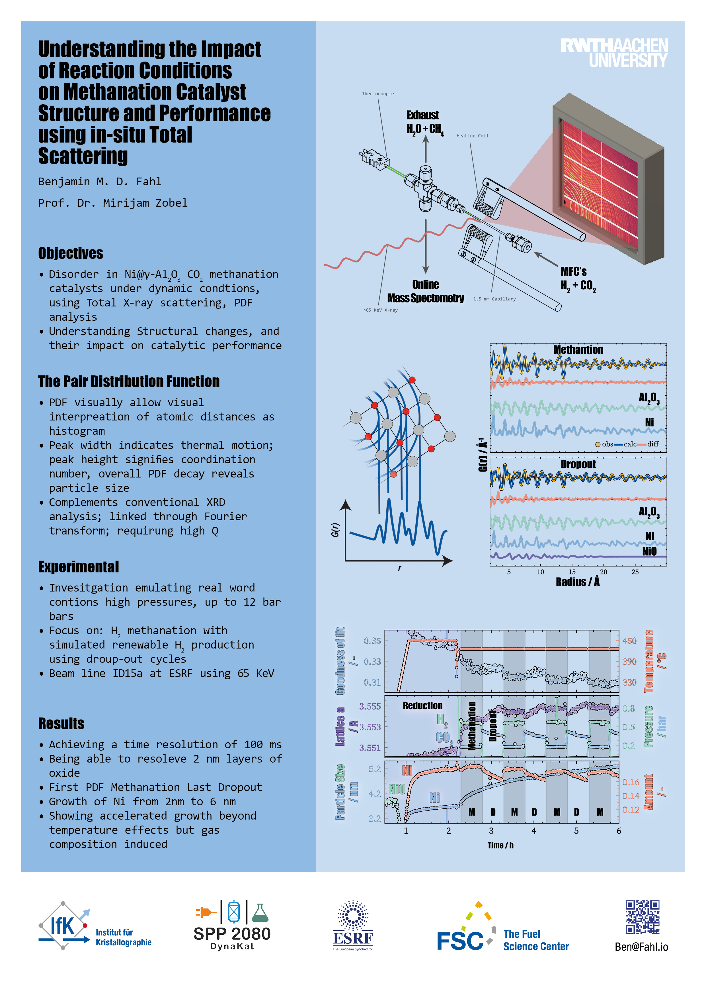

# EuropaCat2023
## Conference Poster

This repository hosts the PDF version of the poster presented at the [EuropaCat2023](https://www.europacat2023.cz). The poster provides an overview of the research conducted and the findings obtained.

### Poster Details

- **Title:** Understanding the Impact of Reaction Conditions on Methanation Catalyst Structure and Performance using in-situ Total Scattering
- **Conference:** EuropaCat
- **Date:** September 2023
- **Authors:** Benjamin M. D. Fahl, Fabio Manzoni, Prof. Dr. Mirijam Zobel
- **Affiliations:** Institute of Crystallography, RWTH Aachen

### Abstract

We utilize in-situ total scattering to probe catalyst structures during catalysis, focusing on methanation optimization through hydrogen fluctuation studies. Pair distribution function (PDF) analysis and mass spectrometry (MS) are integrated for real-time monitoring of particle growth, structural changes, and activity. High-energy X-ray scattering with 2D detectors provides sub-second resolution, simulating real-world-like conditions. Our 6-hour study, combining catalysis and drop-out cycles, unveils dynamic structural shifts at 100 ms resolution. Notably, prolonged hydrogen absence induces distinct lattice parameter changes, impacting catalyst structure and performance. These findings offer vital insights for catalyst design under transient and extended conditions.

### Poster Preview

A preview of the poster is shown below. You can download the full PDF [here](EuropaCat2023.pdf).

